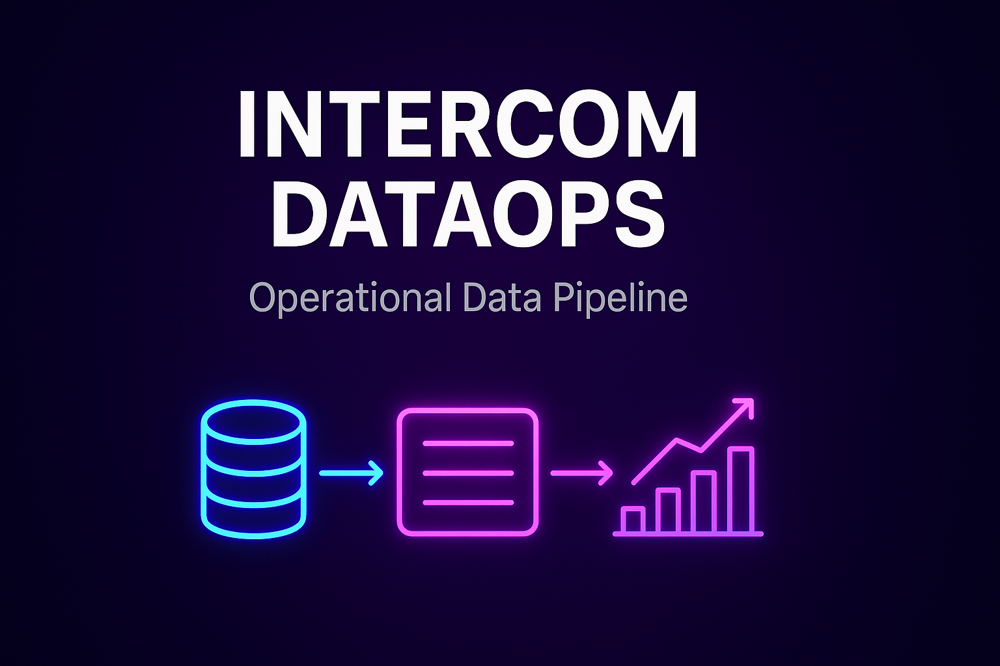

  

  
  
  
  

# Intercom DataOps — Operational Data Pipeline
### Autor: Jonathan Santos de Jesus Sienkiewicz
### Ano: 2025

---

## 📌 Visão Geral

Este projeto implementa um **pipeline completo de DataOps**, simulando a arquitetura real utilizada em times de operações e suporte de empresas orientadas a dados.

O pipeline cobre todo o fluxo:

- Ingestão de dados
- Limpeza e padronização
- Geração de métricas operacionais
- Séries temporais
- Organização em Data Lake local
- Visualização via dashboard (Streamlit)

O objetivo é demonstrar **capacidade prática real em Engenharia de Dados e Analytics Engineering**, com foco em:

- ETL profissional
- Data Cleaning robusto
- Visualização orientada a negócio
- Estruturação de projetos escaláveis

✅ **Importante:** todos os dados utilizados são 100% sintéticos e não representam nenhuma empresa real ou dado sensível.

---

## 🏗️ Arquitetura do Pipeline

    ┌──────────────────────────┐
    │      Arquivos CSV        │
    └─────────────┬────────────┘
                  │
             Ingestão
                  │
    ┌─────────────▼────────────┐
    │       data/raw/          │
    └─────────────┬────────────┘
                  │
          Limpeza + Normalização
                  │
    ┌─────────────▼────────────┐
    │    data/processed/       │
    └─────────────┬────────────┘
                  │
         Métricas + Time Series
                  │
    ┌─────────────▼────────────┐
    │     data/analytics/      │
    └─────────────┬────────────┘
                  │
           Exportação Pipeline
                  │
    ┌─────────────▼────────────┐
    │     data/datalake/       │
    └──────────────────────────┘

---

## 📁 Estrutura do Projeto

projeto-intercom-dataops/
│
├── data/
│   ├── raw/               → Dados brutos sintéticos
│   ├── processed/         → Dados limpos
│   ├── analytics/
│   │   ├── metrics/       → KPIs gerados
│   │   └── time_series/   → Séries temporais
│   └── datalake/          → Data Lake local
│
├── data/cleaning/
│   └── clean_tickets.py
│
├── data/analytics/
│   ├── metrics.py
│   └── time_series.py
│
├── data/export/
│   └── export_to_datalake.py
│
├── dashboard/
│   └── app.py
│
├── assets/
├── requirements.txt
└── README.md

---

## 🚀 Sprints Técnicos

Sprint 1 — Setup & Ingestão  
Criação da estrutura do projeto e ingestão de dados sintéticos.

Sprint 2 — Data Cleaning  
Padronização de colunas, limpeza de dados e validações automáticas.

Sprint 3 — KPIs  
Geração de métricas operacionais por canal, categoria e time.

Sprint 4 — Time Series  
Criação de séries temporais para análise de volume.

Sprint 5 — Data Lake  
Organização final dos dados no Data Lake local.

Sprint 6 — Dashboard  
Dashboard interativo com Streamlit e Plotly.

---

## 📊 Dashboard (Sprint 6)

O projeto inclui um painel interativo construído com **Streamlit**.

Para executar localmente:

    streamlit run dashboard/app.py

---

## 🧰 Tecnologias Utilizadas

- Python
- Pandas
- NumPy
- Faker
- Streamlit
- Plotly

---

## 📦 Instalação

    pip install -r requirements.txt

---

## 📜 Política de Dados

Todos os dados utilizados são **sintéticos**, gerados artificialmente para fins educacionais.  
Não há uso de informações reais, sensíveis ou corporativas.

---

## 📌 Objetivo Profissional

Este projeto foi desenvolvido com foco em demonstrar capacidade prática para vagas de:

- Analista de Dados
- Analytics Engineer
- Engenharia de Dados (nível júnior/pleno)

---

## ✅ Status

Projeto completo, funcional e pronto para demonstração técnica.

---

Autor: Jonathan Santos de Jesus Sienkiewicz
